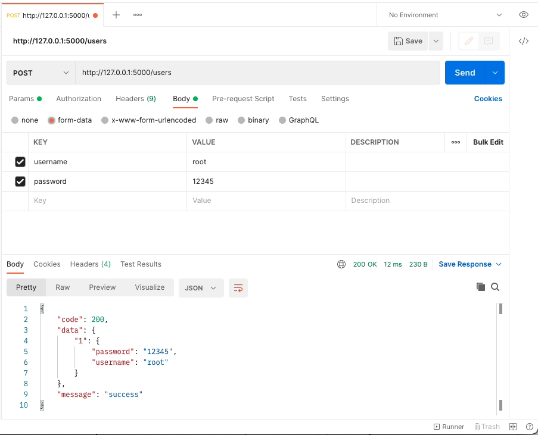
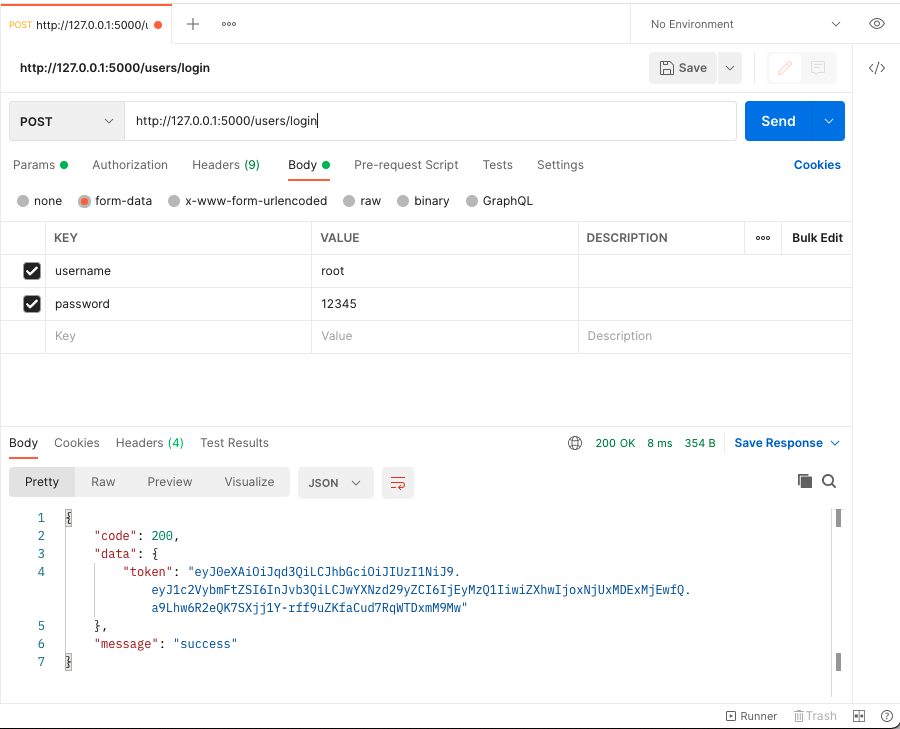
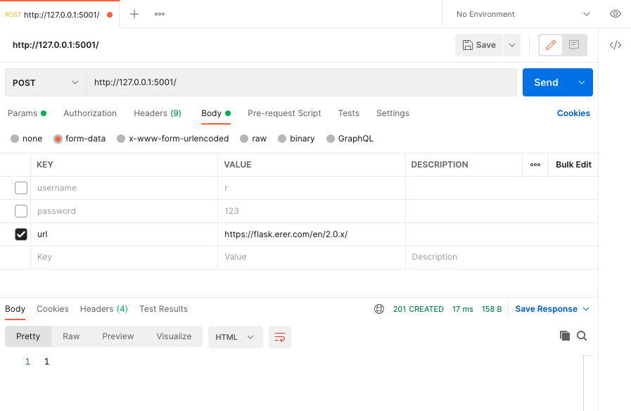

# Web Services and Cloud-Based Systems - Assignment 2
This is the barebone replacement implementation for the first assignment of the Web Services and Cloud-Based Systems course.

You may use this implementation to implement the URL-shortener part of assignment 2 in case you don't have a (working) implementation of your own. However, we strongly recommend you to use your own if possible, since that's definitely way more cool (and functional).

> IMPORTANT: If you use this barebone implementation, make sure you mention that in your report and during your demo. We will assume plagiarism otherwise!!


## Installation
To setup your machine to run the barebone service, first prepare your machine by setting up a virtual environment with the required packages:
```bash
# Setup the virtual environment locally
python3 -m venv ./venv
# Activate it for your current terminal
. venv/bin/activate
# Your terminal now has '(venv)' prepended to the prompt

# Install the dependencies
pip3 install -r requirements.txt
```

You are now ready to run the service.


## Usage
### Starting the service
To run the service, first make sure you have activated the virtual environment (it has to say 'venv' at the start of your terminal):
```bash
. venv/bin/activate
# Your terminal now has '(venv)' prepended to the prompt
```

Then, run the microservice of authentication (on 5000), use:
```bash
FLASK_APP=src/login python3 -m flask run --port 5000
```
And run the microservice of shorten-url (on 5001), use:
```bash
FLASK_APP=src/url-shortener python3 -m flask run --port 5001
```

### Run the authorization test
After running the project, we use postman to test the API. 

Firstly, Create new users with username and password, use the route below with `POST` method:
`http://127.0.0.1:5000/users`

The result is as follow：


Then use the login route `http://127.0.0.1:5000/users/login` with `POST`method to create the JWT and bind the JWT value to this user.

The result is as follow：


Then put the JWT that just generated in the header as value with the key name `Authorization`. Carry the jwt access API on port 5000.

The example is as follow：

request `http://127.0.0.1:5001/` with form-data `url` as key and its value.


Only the GET method remains unprotected since it is public.
## Documentation
The whole service is implemented in `src/url-shortener.py`, which is commented to show which part of the file does what.
